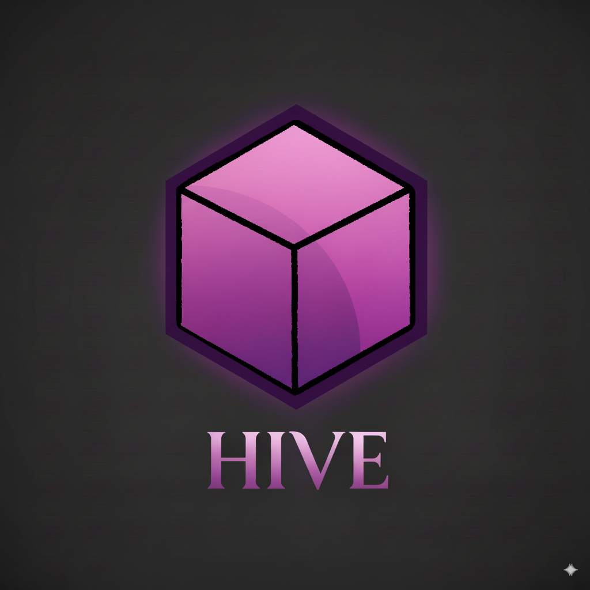

# 🐝 Hive — Distributed AI Worker Queue

<p align="center">
  
</p>

## Overview
Hive is a distributed system that manages **task execution across multiple worker containers**.  
Think of it as a *swarm of AI bees* (workers) organized by a **dispatcher** (queen bee),  
each handling tickets one at a time. Extra tasks are queued and executed as soon as workers free up.

### Key Features
- **Queue-based Scheduling**: Enqueue tasks, workers pick them up when available.
- **Scalable Workers**: Run up to 10 workers on a local gaming PC (or more in the cloud).
- **Ticket Runner**: Tasks can be auto-generated, CRON-triggered, or created manually via API/UI.
- **Analytics Integration**: Read logs, metrics, or external feeds → generate tickets automatically.
- **Execution in Containers**: Workers run inside Docker containers for isolation & reproducibility.
- **Callback System**: Tasks report progress + final status to your backend.
- **Authentication**: Internal API token (for CRON/agents) + planned OAuth/JWT integration for UI.
- **Future Scaling**: Deploy to [Fly.io](https://fly.io) for horizontal scaling across regions.

---

## 🏗 Architecture
- **Dispatcher**: Manages the task queue, assigns jobs to free workers.
- **Workers**: Docker containers running AI agents or automation scripts.
- **Queue**: FIFO job buffer (in-memory, Redis planned).
- **Callback**: Workers notify Dispatcher → Dispatcher notifies the Hive backend/UI.
- **Roles**: Workers may specialize (builder, tester, analyzer) to form layered workflows.

See [ARCHITECTURE.md](./docs/ARCHITECTURE.md) for full details.

---

## 🚀 Quick Start (Local)
1. **Clone & Build**
   ```bash
   git clone https://github.com/your-org/hive.git
   cd hive
   docker compose up -d --build
   ```

2. **Check health**
   ```bash
   curl http://localhost:8099/health
   ```

3. **Enqueue a task**
   ```bash
   curl -X POST http://localhost:8099/enqueue      -H "Authorization: Bearer $INTERNAL_API_TOKEN"      -H "Content-Type: application/json"      -d '{
       "jobId": "demo-1",
       "repo": "https://github.com/jobrayan/codimir-web.git",
       "branch": "ci/demo",
       "base": "main",
       "task": "agent",
       "instructions": "Add README quickstart",
       "githubToken": "ghp_..."
     }'
   ```

4. **Watch logs**
   ```bash
   docker logs -f hive-dispatcher
   docker logs -f hive-worker-1
   ```

---

## 🔒 Authentication
- **Dispatcher**: requires `INTERNAL_API_TOKEN` for all `/enqueue` requests.
- **Workers**: trust Dispatcher via shared `CALLBACK_SECRET`.
- **Future**: OAuth/JWT for user-facing UI.

See [AUTH.md](./docs/AUTH.md) for a deeper dive.

---

## 🌐 Roadmap
- [ ] Redis-backed persistent queue  
- [ ] Worker specialization (roles: builder, tester, analyzer)  
- [ ] Auto-ticket generation from analytics/logs  
- [ ] Fly.io integration for elastic scaling  
- [ ] Web UI for monitoring + control  

---

## 📜 License
MIT © Jobrayan, Inc.